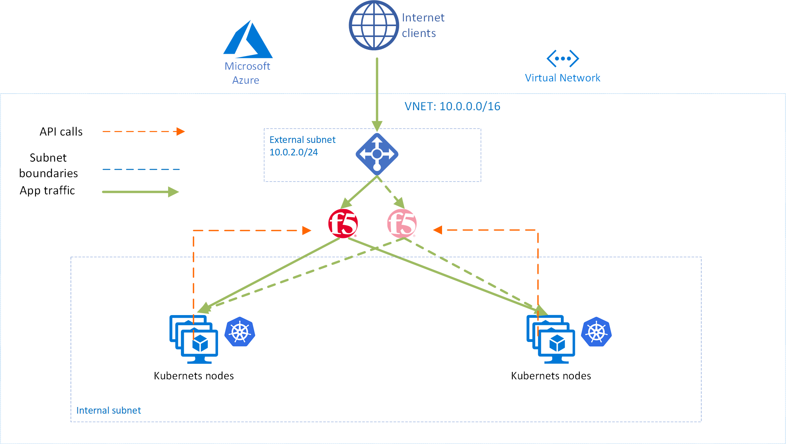
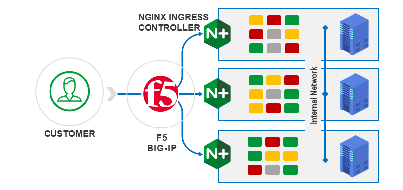

# Multi-Cluster_K8s-SuperVIP
Multi-Cluster K8S Cluster using F5 CIS and LTM SuperVIP for L7 Routing


Table of contents
=================

<!--ts-->
   * [Purpose and Overview](#purpose-and-overview)
   * [Architecture](#architecture)
   * [Prerequisites](#prerequisites)
   * [Instructions](#instructions)
   * [Conclusion](#conclusion)
   * [Support](#support)
<!--te-->
## Purpose and Overview
This demo uses Terraform to deploy 2x clusters on Azure Kubernetes Service (AKS), and 2x F5 BIG-IP devices.

The demo app can be viewed from the internet if you wish, and instructions for deleting this demo are included also.

## Architecture
### Cloud Infrastructure provisioned

### Focused architecture of traffic flow


## Prerequisites
1. The Terraform version used for this lab is <b>1.0.10</b> 
2. Azure CLI is installed and authenticated.
3. <b>You need details of a ServicePrincipal in Azure.</b>
In this demo your Azure account will be accessed by Terraform using a Service Principal. You can set up a ServicePrincipal by following [these instructions](https://docs.microsoft.com/en-us/cli/azure/create-an-azure-service-principal-azure-cli). <b>The SP should have contributor access in the subscription because it will need to create a Resource Group.</b>

## Quick deploy
If you have run this lab before and are only looking to stand up the demo as quickly as possible, you can clone the repo, update ```infra/variables.tf```, and run the script at [deploy.sh](deploy.sh) to deploy, and [destroy.sh](destroy.sh) to destroy. Script should be run from root directory of repo.

## Instructions

Run ```git clone <repo url>``` to copy the Terraform files we need locally.

### Set your variables and deploy environment
Change directories to the infra folder. We will then need to update the file called variables.tf to reflect your own Service Principle details:

    cd Multi-Cluster_K8s-SuperVIP/infra

... and use your favorite editor to update variables.tf, for example:

    vi variables.tf

You want your variables.tf file to include this below. Obviously, replace my xxx with your SP details, and you can create your own prefix value and Azure location if you wish. Of course, in production, use a better password than below.

<b>Your variable of "prefix" should be unique and all lower case.</b> It will be used to create a Resource Group, along with other resource types.

<b>Your variable of "upassword" should be over 12 characters and contain 3 of the following 4 character types: lower case, upper case, numbers, and special characters.</b> It will be used as the password on the F5 BIG-IP devices, along with the windowsProfile on the AKS cluster.

    #Azure SP cred details
    variable "client_id" {default = "xxxxxxxx-xxxx-xxxx-xxxx-xxxxxxxxxxxx"}
    variable "client_secret" {default = "xxxxxxxxxxxxxxxxxxxxxxxxxxxxxxxx"}
    #BIG-IP variables
    variable "prefix" {default = "someuniquevalue"}
    variable "uname" {default = "azureuser"}
    variable "upassword" {default = "DefaultPass12345!"}
    variable "location" {default = "East US 2"}
    #Network variables
    variable "network_cidr" {default = "10.0.0.0/16"}
    variable "mgmt_subnet_prefix" {default = "10.0.1.0/24"}
    variable "external_subnet_prefix" {default = "10.0.2.0/24"}
    variable "internal_subnet_prefix" {default = "10.0.3.0/24"}

Now, deploy via script. If you prefer, look at the script contents and deploy manually step by step yourself.

    cd ../
    . /deploy.sh

### Verify and review your environment
Once this is complete, you will have a running app inside Kubernetes that is exposed to the internet via F5 BIG-IP, and NGINX ingress controller. The value of this demo is not in exposing the app, but in the possibilities that now exist for the application owner, such as:
- using NGINX Ingress Controller as a means to control app traffic, thereby releiving F5 admins of the need for regular updates, or
- applying WAF and security controls at BIG-IP or at NGINX, whichever is preferred by the organization, or,
- managing TLS certificates at BIG-IP, NGINX, or both,
- etc.

### Delete environment 
Finally, don't forget to delete your resources!

    cd ./destroy.sh

## Support
This repo is not supported by F5. Please submit issues via GitHub for community support.
    
